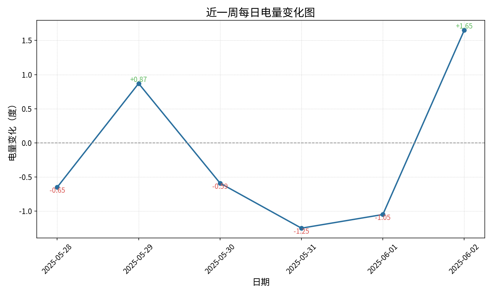

# ⚡ ElectricQuery 电量通知系统

一个自动查询宿舍电量并通过多渠道发送提醒的 Python 工具。支持邮箱通知、企业微信机器人，记录历史电量并对比分析每日消耗📊。

---

## 🧩 功能特性

- ✅ 自动登录系统查询宿舍电量
- 📬 支持邮件提醒（SMTP）
- 🗨️ 支持企业微信机器人通知
- 🗃️ 使用 SQLite 本地数据库保存每日电量记录
- 📉 比较最近三天的电量消耗趋势
- 🛠️ 可自由扩展其他发送方式（通过插件式设计）

---

## 📦 使用说明

1. **配置环境**

```bash
pip install -r requirements.txt
```

2. **编辑配置文件**

修改 `config.yml`，填入宿舍信息、SMTP 配置、Webhook 地址等：

```yaml
enabled_senders:
  - email
  - wechat
smtp:
  server: smtp.163.com
  ...
power_checker:
  login_url: http://ydgl.xzcit.cn/web/Default.aspx
  ...
```

3. **运行脚本**

```bash
python main.py
```

4. **docker部署**
```bash
cd /ElectricQuery && docker compose build
```

5. **定时运行**

```yaml
0 8 * * * cd /ElectricQuery && /usr/bin/docker compose run --rm power_checker
```

---

## 🧠 示例输出

```
【【电量告警】剩余电量过低】
当前剩余电量为 19.96 度，低于设定阈值 20 度，请及时充值。
```

```
📊 【每周电量报告】
本周电量记录如下：
----------------------------
2025-05-27 | 剩余电量: 50.85 | 当天消耗: 暂无数据
2025-05-28 | 剩余电量: 50.20 | 当天消耗: -0.65 度
2025-05-29 | 剩余电量: 51.07 | 当天消耗: +0.87 度
2025-05-30 | 剩余电量: 50.48 | 当天消耗: -0.59 度
2025-05-31 | 剩余电量: 49.23 | 当天消耗: -1.25 度
2025-06-01 | 剩余电量: 48.18 | 当天消耗: -1.05 度
2025-06-02 | 剩余电量: 49.96 | 当天消耗: +1.78 度
```


---

## 📁 项目结构

```
📁 ./
├── 📁 utils/                 # 工具类模块
│   ├── configManager.py      # 配置加载与初始化
│   ├── senderManager.py      # 通知发送模块（支持多方式）
│   ├── dataManager.py        # 数据库管理（记录与查询电量）
│   ├── analyzer.py           # 数据处理（电量差值计算）
│   ├── chart.py              # 图标绘制（折线图绘制部分）
│   └── logger.py             # 日志记录配置
├── 📁 logs/                 # 日志文件夹
├── 📁 data/                 # 数据文件夹
│   └── power_history.db      # SQLite 数据库（自动创建）
├── 📁 fonts/ 
│   └── SourceHanSansSC-Regular.otf  # 字体文件
├── requestNum.py             # 电量查询主逻辑
├── main.py                   # 主运行脚本，执行查询+通知
├── config.yml                # 配置文件
├── docker-compose.yml        # Compose配置
├── Dockerfile                # 镜像构建脚本
├── requirements.txt          # 依赖文件
└── README.md                 # 自述文件

```

---

## 📜 开源协议

本项目基于 [MIT License](https://opensource.org/license/mit/) 许可证开源，欢迎自由使用、修改、学习、贡献！

---

## 🙋‍♂️ 作者

CitrusCandy · 砂糖桔
如果你觉得有用，欢迎 ⭐️ Star 一下！
